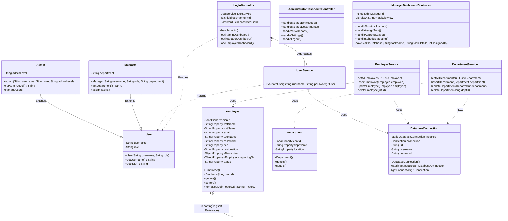

# OMS Class Diagram

This diagram outlines the core application structure, focusing on the models, services, and key controller relationships in the Office Management System (OMS) application.

```mermaid
classDiagram
    %% Core Entities / Models
    class User {
        -String username
        -String role
        +User(String username, String role)
        +getUsername() String
        +getRole() String
    }

    class Admin {
        -String adminLevel
        +Admin(String username, String role, String adminLevel)
        +getAdminLevel() String
        +manageUsers()
    }

    class Manager {
        -String department
        +Manager(String username, String role, String department)
        +getDepartment() String
        +assignTasks()
    }

    class Employee {
        -LongProperty empId
        -StringProperty firstName
        -StringProperty lastName
        -StringProperty email
        -StringProperty userName
        -StringProperty password
        -StringProperty role
        -StringProperty designation
        -ObjectProperty~Date~ dob
        -ObjectProperty~Employee~ reportingTo
        -StringProperty status
        +Employee()
        +Employee(long empId)
        +getters()
        +setters()
        +formattedDobProperty() StringProperty
    }

    class Department {
        -LongProperty deptId
        -StringProperty deptName
        -StringProperty location
        +Department()
        +getters()
        +setters()
    }

    Admin --|> User : Extends
    Manager --|> User : Extends
    Employee "1" o-- "1" Employee : reportingTo (Self Reference)

    %% Services
    class UserService {
        +validateUser(String username, String password) User
    }

    class EmployeeService {
        +getAllEmployees() List~Employee~
        +insertEmployee(Employee employee)
        +updateEmployee(Employee employee)
        +deleteEmployee(int id)
    }

    class DepartmentService {
        +getAllDepartments() List~Department~
        +insertDepartment(Department department)
        +updateDepartment(Department department)
        +deleteDepartment(long deptId)
    }

    %% Database
    class DatabaseConnection {
        -static DatabaseConnection instance
        -Connection connection
        -String url
        -String username
        -String password
        -DatabaseConnection()
        +static getInstance() DatabaseConnection
        +getConnection() Connection
    }

    %% Controllers (Simplified view)
    class LoginController {
        -UserService userService
        -TextField usernameField
        -PasswordField passwordField
        +handleLogin()
        -loadAdminDashboard()
        -loadManagerDashboard()
        -loadEmployeeDashboard()
    }

    class AdministratorDashboardController {
        +handleManageEmployees()
        +handleManageDepartments()
        +handleViewReports()
        +handleSettings()
        +handleLogout()
    }

    class ManagerDashboardController {
        -int loggedInManagerId
        -ListView~String~ taskListView
        +handleCreateMilestone()
        +handleAssignTask()
        +handleApproveLeave()
        +handleScheduleMeeting()
        -saveTaskToDatabase(String taskName, String taskDetails, int assignedTo)
    }

    %% Relationships
    UserService ..> DatabaseConnection : Uses
    EmployeeService ..> DatabaseConnection : Uses
    DepartmentService ..> DatabaseConnection : Uses

    UserService ..> User : Returns
    EmployeeService ..> Employee : Uses
    DepartmentService ..> Department : Uses

    LoginController "1" *-- "1" UserService : Aggregates
    LoginController ..> User : Handles
```
